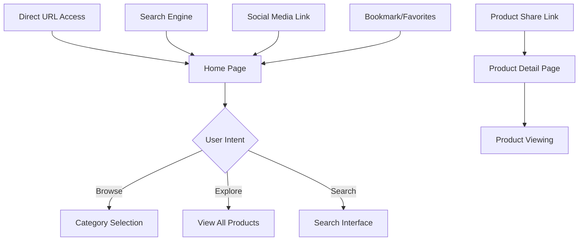
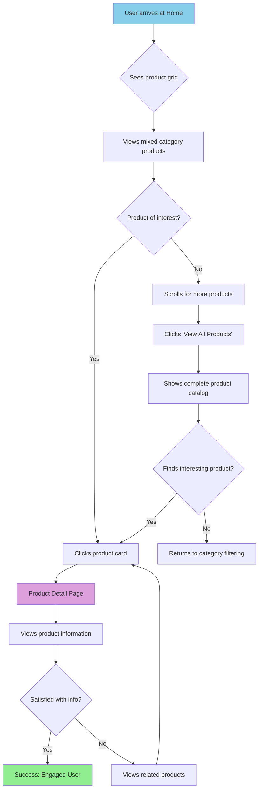
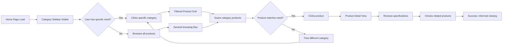
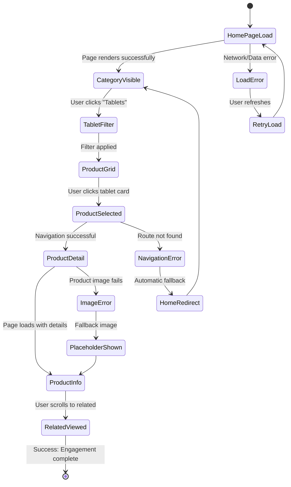
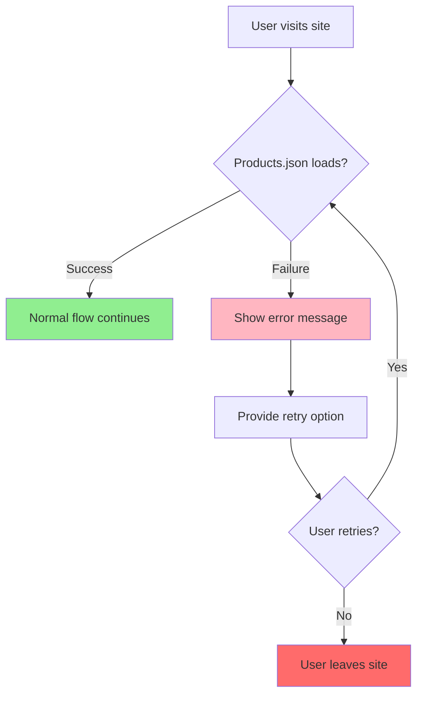
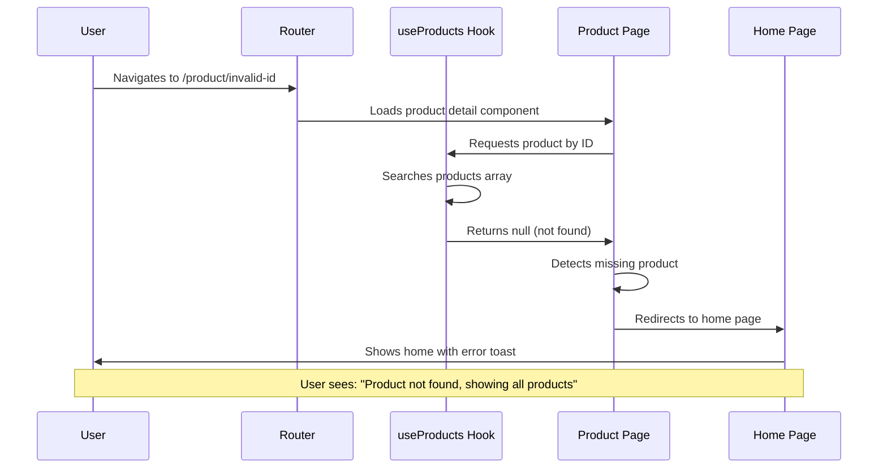
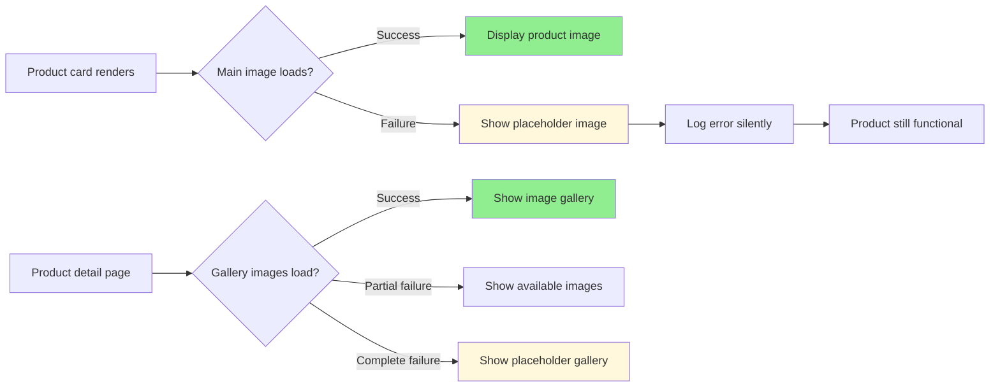
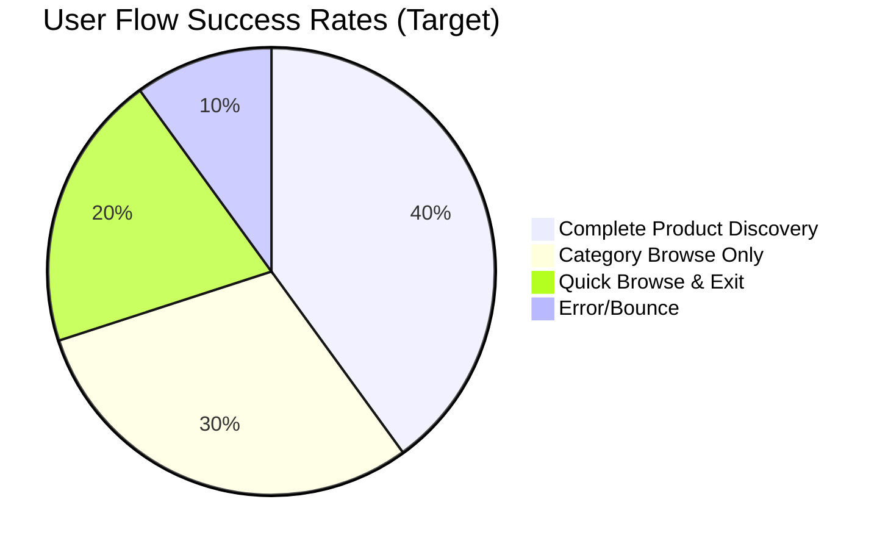

# E-Commerce Application User Experience Flow

## Overview
This document outlines the core user experience flows for the e-commerce MVP application with a 1-hour implementation timeline. The focus is on essential browsing and product discovery functionality, ensuring smooth user journeys while maintaining development feasibility.

## Application Context
- **Target**: Electronics e-commerce PoC
- **Timeline**: 1-hour development constraint
- **Core Features**: Product browsing, category filtering, product details
- **User Base**: General consumers looking for electronic products
- **Platform**: Desktop and mobile responsive web application

---

## User Journey Map

### Entry Points


### Critical Success Paths
1. **Product Discovery Path**: Home → Category Filter → Product Selection → Product Details
2. **Browse All Path**: Home → View All Products → Product Selection → Product Details  
3. **Related Product Path**: Product Details → Related Products → New Product Details

### Exit Points
- **Successful Engagement**: Product detail view with interest shown
- **Quick Browse**: Multiple product cards viewed (engagement metrics)
- **Bounce**: Single page view without interaction
- **Navigation**: Return to category or home page for continued browsing

---

## Core Interaction Flows (MVP Only)

### Flow 1: Product Discovery Journey

```mermaid
sequenceDigram
    participant U as User
    participant H as Home Page
    participant S as Category Sidebar
    participant P as Product Grid
    participant D as Product Detail
    
    U->>H: Lands on homepage
    H->>U: Shows "Explore Our Products" + grid
    U->>S: Clicks "Tablets" category
    S->>P: Filters products by tablets
    P->>U: Shows filtered tablet products
    U->>P: Clicks product card
    P->>D: Navigates to product detail
    D->>U: Shows full product information
    
    Note over U,D: Happy Path Complete
    
    U->>D: Views related products
    D->>D: Shows related items section
    U->>D: Clicks related product
    D->>D: Updates to new product
```

### Flow 2: Browse All Products Journey



### Flow 3: Category-Focused Shopping



---

## Detailed Example Flow: Product Discovery with Error Scenarios

### Happy Path: Tablet Shopping Journey



### Error Handling Scenarios

#### Scenario 1: Data Loading Failures


#### Scenario 2: Invalid Product ID


#### Scenario 3: Image Loading Failures


---

## Success Metrics & Key Performance Indicators

### Primary Success Metrics (MVP)

#### User Engagement Metrics
- **Page Views per Session**: Target 3+ pages (Home → Category/Product → Details)
- **Category Interaction Rate**: % of users who click sidebar categories
- **Product Detail Views**: % of users who reach product detail pages
- **Related Product Clicks**: Engagement with related items section

#### Technical Performance Metrics
- **Page Load Time**: < 2 seconds for initial home page
- **Category Filter Response**: < 500ms for filtering
- **Navigation Speed**: < 1 second between pages
- **Error Rate**: < 5% of user interactions

#### User Flow Completion Rates


### Secondary Success Metrics

#### Behavioral Indicators
- **Return to Category**: Users returning to browse other categories
- **Multiple Product Views**: Users viewing 2+ product details
- **Search Interaction**: Users engaging with search UI (even if non-functional)
- **Mobile Responsiveness**: Smooth experience across device sizes

#### Quality Metrics
- **Zero JavaScript Errors**: Clean console in production
- **Responsive Design**: Works on mobile, tablet, desktop
- **Accessibility**: Basic keyboard navigation works
- **Loading States**: Users see feedback during transitions

---

## User Experience Principles for MVP

### Core Design Principles
1. **Immediate Value**: Users see products within 2 seconds
2. **Clear Navigation**: Category system is intuitive and responsive
3. **Progressive Disclosure**: Basic info on cards, detailed info on product pages
4. **Graceful Degradation**: App works even when images fail to load

### Interaction Guidelines
1. **Single-Click Actions**: Major actions require only one click
2. **Visual Feedback**: Hover states and loading indicators
3. **Error Recovery**: Clear paths back to working states
4. **Mobile-First**: Touch-friendly interface elements

### Content Strategy
1. **Scannable Product Cards**: Key info visible at glance
2. **Detailed Product Pages**: Complete information without clutter
3. **Related Products**: Help users discover similar items
4. **Category Organization**: Logical grouping of electronics

---

## Implementation Priority for User Flows

### Phase 1: Core Navigation (Steps 1-8)
**Target Flow**: Home → Category Filter → Product Grid Display
- **User Need**: Basic product browsing
- **Success Criteria**: Users can filter and view products
- **Key Interactions**: Category clicks, product card display

### Phase 2: Product Discovery (Steps 9-12)  
**Target Flow**: Product Card → Product Detail → Related Products
- **User Need**: Detailed product information
- **Success Criteria**: Users can view complete product details
- **Key Interactions**: Product clicks, image gallery, related items

### Phase 3: Enhanced Experience (Steps 13-15)
**Target Flow**: Seamless navigation between all sections
- **User Need**: Smooth browsing experience
- **Success Criteria**: Error-free navigation, responsive design
- **Key Interactions**: Breadcrumbs, error handling, mobile optimization

---

## Risk Mitigation for User Experience

### High-Risk User Scenarios
1. **Empty Product Categories**: Show "No products found" with suggestion to view other categories
2. **Slow Image Loading**: Implement skeleton loading and fallback images
3. **Navigation Confusion**: Clear breadcrumbs and consistent back navigation
4. **Mobile Usability**: Ensure touch targets are minimum 44px, readable text

### Fallback Strategies
1. **Data Loading Issues**: Show cached/placeholder content
2. **Route Errors**: Automatic redirect to home page with notification
3. **Image Failures**: Branded placeholder images maintain visual consistency
4. **Performance Issues**: Progressive loading with priority on critical content

---

**Total User Experience Scope**: 3 core flows covering essential e-commerce browsing
**Implementation Alignment**: Each flow maps directly to development phases
**Success Measurement**: Clear metrics for validating PoC effectiveness
